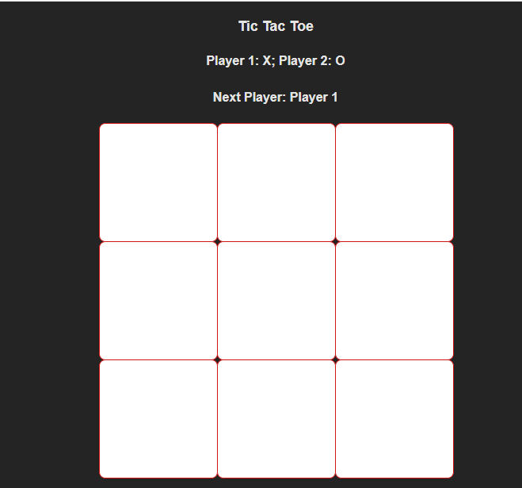

# Tic Tac Toe

This is a tic-tac-toe web app game for the AfriEd development

## Table of contents

- [Overview](#overview)
  - [Screenshot](#screenshot)
  - [Links](#links)
- [Our process](#our-process)
  - [Built with](#built-with)
  - [Continued development](#continued-development)
  - [Useful resources](#useful-resources)
- [Authors](#authors)

**Note: Delete this note and update the table of contents based on what sections you keep.**

## Overview

Play Tic-tac-toe with a friend and find out who's the best

### Screenshot

Site uses black, white and aqua colors

### Links

- Live Site URL unavailable: [Live Site]()

## Our process

### Built with

- Semantic HTML5 markup
- CSS custom properties
- [React](https://reactjs.org/) - JS library

### Continued development

Areas of continued development include:
- Changing starting player each round

### Useful resources

- [YouTube](https://www.youtube.com/watch?v=ff5cBkPg-bQ&list=PLEPZdzLLJH96venmwTpHqH0160NbIHmC5) - We went through the basics of github projects via this YouTube video
- [Stack Overflow](https://stackoverflow.com) - The best site to get all your programming questions answered

## Authors

- [King Eshiebor](https://www.github.com/kingalingaling)
- [Jonah Samuel](https://www.github.com/LovingBrother)
- [Aroh Ebenezer](https://www.github.com/Benny-Nwaro)